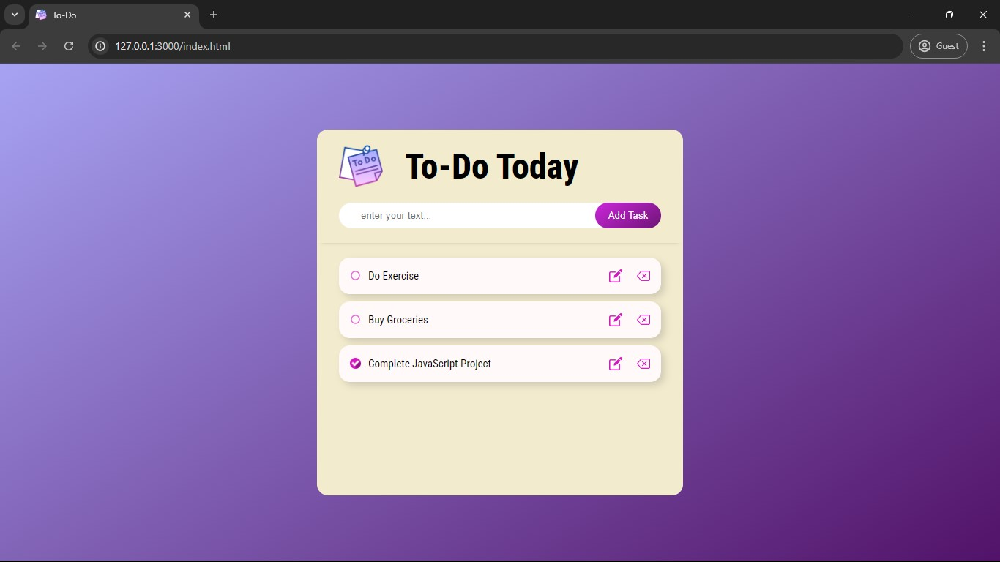

# To-Do List

This To-Do List application is a simple, interactive web-based tool for managing tasks. It allows users to add, update, and delete tasks. The app is built using HTML, CSS, and JavaScript, and it leverages local storage to persist tasks across sessions.

To view this project , visit [here](https://aimless-coder.github.io/To_Do_list/))

## Table of Contents

- [Demo](#demo)
- [Features](#features)
- [Installation](#installation)
- [Usage](#usage)
- [Acknowledgements](#acknowledgements)
  
## Demo




## Features

- Add Tasks: Users can input tasks using a text input field and add them to the list.
- Update Tasks: Existing tasks can be edited.
- Delete Tasks: Users can remove tasks from the list.
- Toggle Task Completion: Users can mark tasks as complete or incomplete.
- Persistent Storage: Tasks are saved in the browser's local storage, allowing them to persist between sessions.
- The app works on both desktop and mobile devices.

## Installation

To get a local copy up and running follow these simple steps:

1. Clone the repository:
   ```sh
   git clone https://github.com/aimless-coder/To_Do_list.git
   ```

2. Open `index.html` in your browser

    
## Usage

- Enter Task: Type your task into the input field.
- Add: Click the "Add Task" button or press Enter.
- Toggle Completion: Click the task or checkbox to mark it as complete/incomplete.
- Edit: Click the edit icon to modify a task, then click "Update."
- Delete: Click the delete icon to remove a task.
- Tasks are automatically saved in your browser's local storage and will persist across sessions.


## Acknowledgements

 - [toastify-js](https://github.com/apvarun/toastify-js) : A lightweight JavaScript library to show toast notifications.


